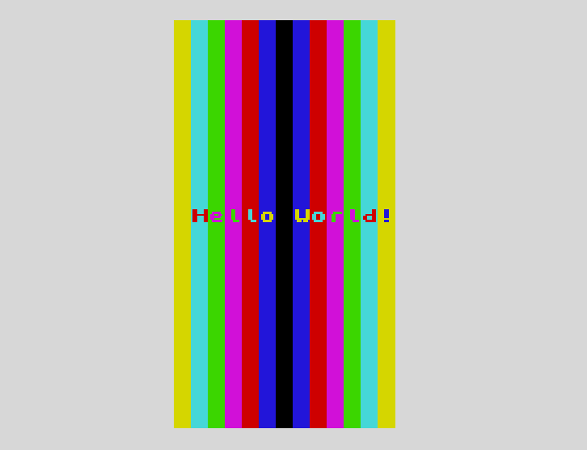

# Hello world!
### Not so basic Z80 Assembly demo for ZX Spectrum 48K

- Custom subroutines for faster text printing
- Screen memory as a linear set of tiles (24 rows, 32 columns)
- Creates custom font in a dedicated memory location using a ROM font with bit shifting

.vscode folder contains setup for quick debugging with DeZog and sjasmplus, provided they are installed